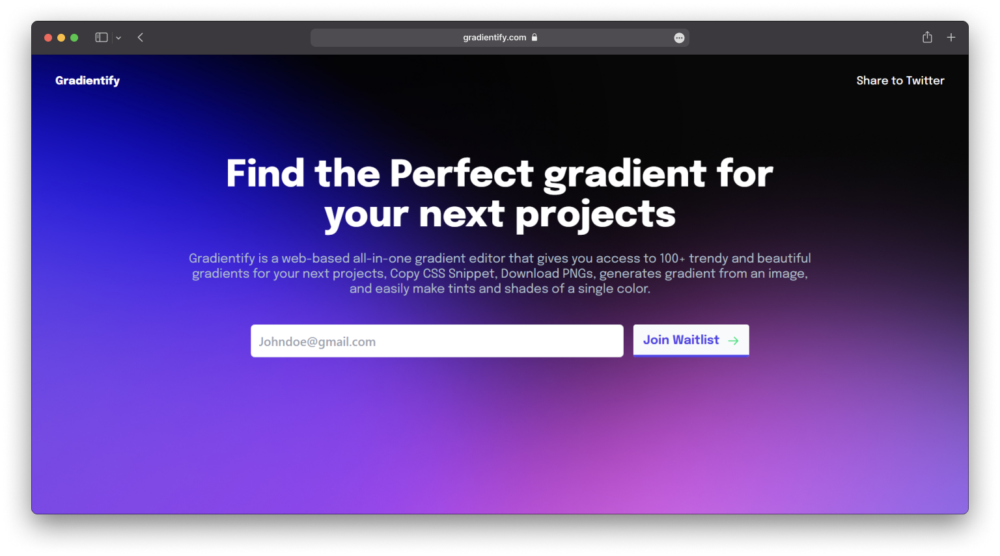

<h3 align="center">The Web based Gradient editor built for everyone</h3>

### Introducing Gradientify

Gradientify is a web-based all-in-one gradient editor that gives you access to 100+ trendy and beautiful gradients for your next projects, Copy CSS Snippet, Download PNGs, generates gradient from an image, and easily make tints and shades of a single color.

[Read Blog]()

